# DistilLog
Repository for the paper: Efficient Log-based Anomaly Detection with Knowledge Distillation

**Abstract**: Logs are produced by many systems for troubleshooting purposes. Detecting abnormal events is crucial to maintain regular operation and secure the security of systems. Despite the achievements of deep learning models on anomaly detection, it still remains challenging to apply these deep learning models in some scenarios, one popular case that deploying on resources-constrained scenarios such as IoT devices, due to the limitation of computational resources on these devices. We identify two main problems of adopting these deep learning models in practice, including: (1) they cannot deploy on resource-constrained devices because of the size and speed of large models, and (2) they cannot achieve satisfactory detection accuracy with simple models.  In this work, we proposed a novel lightweight anomaly detection method from system logs, DistilLog to overcome these problems. DistilLog utilizes a pre-trained word2vec model to represent log event templates as semantic vectors, incorporated with the PCA dimensionality reduction algorithm to minimize computational and storage burden. The Knowledge Distillation technique is applied to reduce the size of the detection model meanwhile maintaining the high detection accuracy. The experimental results show that DistilLog can achieve high F-measures of 0.964 and 0.961 on HDFS and BGL datasets while maintaining the minimized model size and fastest detection speed. This effectiveness and efficiency demonstrate the potential for widespread use in most scenatios, by showing the ability to deploy the proposed model on resource-constrained systems.

## I. Framework

 An overview of DistilLog

DistilLog consists of the following components:
1. **Preprocessing**: Extracting the log templates using log parser.
2. **Semantic Embedding**: DistilLog extracts the semantic information of log events by applying a pretrained word2vec  model (FastText) then using PCA algorithm for dimensionality reduction.
3. **Classification**: Anomaly detection using a teacher-student architecture-based GRU model with attention. In this step include training student from teacher model via knowledge distillation.

## II. Requirements
1. Python 3.7+
2. PyTorch 1.11.0
3. cuda 11.3
4. fasttext
5. scikit-learn
6. pandas
7. numpy
8. torchinfo
9. overrides
## III. Usage:
### 3.1. Demo
- Train/Test teacher-student Model

See [notebook](demo/DistilLog_on_HDFS.ipynb)
## 3.2. Data and Models
Datasets: [Data](https://zenodo.org/record/3227177)

Pre-trained models can be found here: [HDFSmodel](distillog/datasets/HDFS/model.zip) or [BGLmodel](distillog/datasets/BGL/model.zip)
## IV. Results
### 4.1. Baselines
| Methods   | References                             |
|-----------|----------------------------------------|
| LightLog  | [**Computer Network 203 (2022)**] [LightLog: A lightweight temporal convolutional network for log anomaly detection on the edge](https://www.sciencedirect.com/science/article/abs/pii/S1389128621005119) by Z Wang, J Tian, H Fang, L Chen, J Qin.|
| DeepLog   | [**CSS' 2017**] [DeepLog: Anomaly Detection and Diagnosis from System Logs through Deep Learning](https://dl.acm.org/doi/abs/10.1145/3133956.3134015) by Min Du, Feifei Li, Guineng Zheng, Vivek Srikumar|
| LogRobust | [**ESEC/FSE'19**] [Robust log-based anomaly detection on unstable log data](https://dl.acm.org/doi/10.1145/3338906.3338931) by Xu Zhang, Yong Xu, Qingwei Lin, Bo Qiao, Hongyu Zhang, Yingnong Dang, Chunyu Xie, Xinsheng Yang, Qian Cheng, Ze Li, Junjie Chen, Xiaoting He, Randolph Yao, Jian-Guang Lou, Murali Chintalapati, Furao Shen, Dongmei Zhang|

### 4.2. RQ1: Effectiveness and efficiency
- Effectiveness

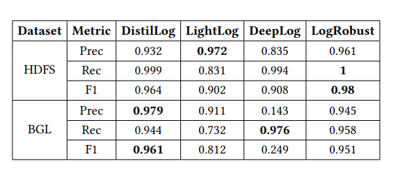  Comparison with different methods in effectiveness

- Efficiency

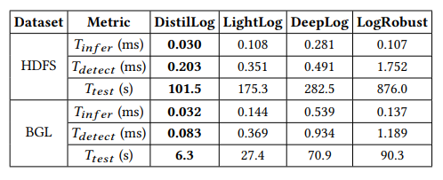  Comparison with different methods in efficiency

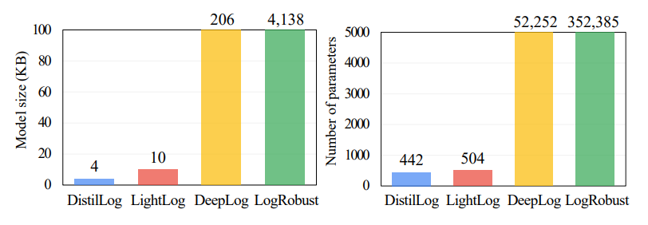  Comparison in terms of the model size and number of parameters 

### 4.3. RQ2: Contribution of main components to DistilLog
#### 4.3.1. Knowledge Distillation
We compare DistilLog with other variants: 
- **Teacher**: We directly leverage the large teacher model for the evaluation and report the results
- **DistilLog_NoKD**: We use a model with the same student’s architecture of DistilLog and train it from
scratch without Knowledge Distillation 

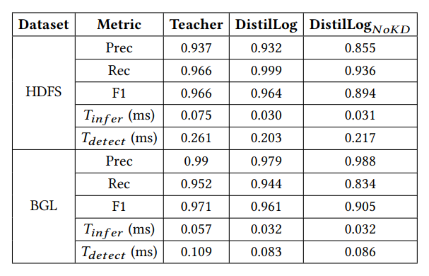   Results of DistilLog without Knowledge Distillation

- **DistilLog_prune**: Instead of compressing the teacher model with Knowledge Distillation, we utilize model pruning to eliminate the weights with low magnitude from the teacher model
- **DistilLog_quant**: We replace Knowledge Distillation in DistilLog with the quantization technique to represent the weights and activations in the teacher model with lower precision data types (e.g., 8-bit integer)

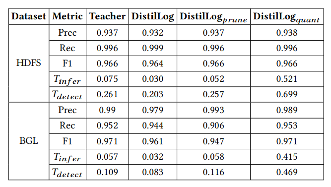  Comparison with different model compression techniques

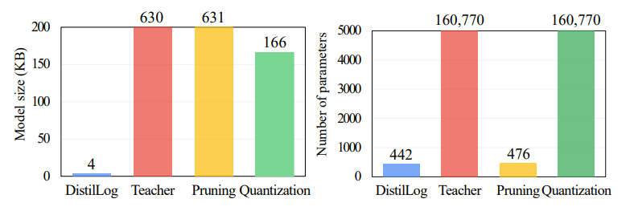  Comparison in terms of the model size and number of parameters

#### 4.3.2. GRU Model
We evaluate the contribution of GRU by comparing it with those variants of DistilLog using LSTM (Long
short-term memory) and CNN (Convolutional Neural Network). These model types are widely used for log-based anomaly detection due to their high accuracy.

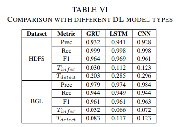  Comparison with different deep learning model types

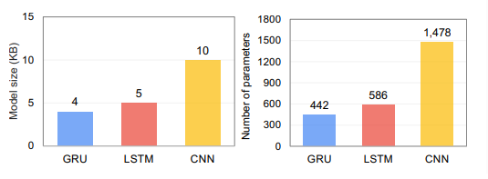  Comparison in terms of the model size and number of parameters with different model types

### 4.4. RQ3: Ablation Study

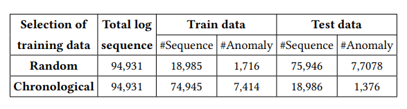 Set up of the BGL dataset in different selections of training data

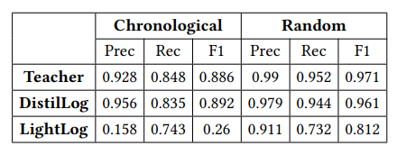 Results with different training data selections on the BGL dataset

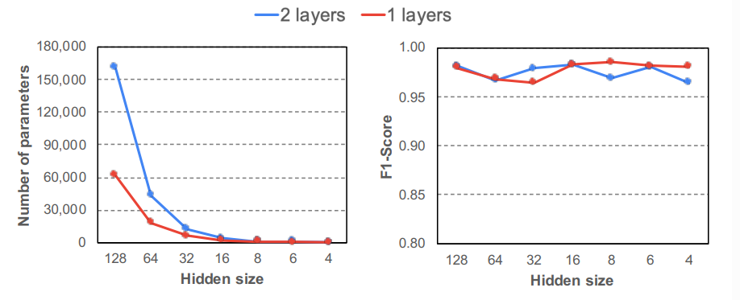  Results of DistilLog on the HDFS dataset with different hidden sizes and numbers of GRU layers

## 5. A case study on end devices
The result of DistilLog and LightLog on a  Raspberry Pi 4 device with an ARM Cortex-A72 CPU (1.5GHz) and 4GB RAM.

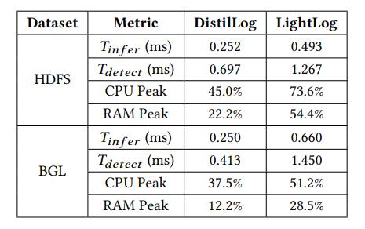  Results of our case study on an end device

